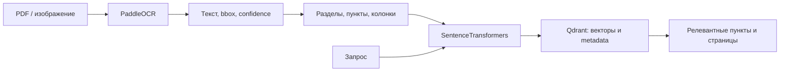

# Локальная обработка договоров: OCR + RAG

Задача: превратить сканированный договор в доступные для семантического поиска пункты с привязкой к исходным страницам.

- FastAPI-сервисы OCR и ingestion/search, Docker Compose.
- Структурный chunking: продолжения пунктов объединяются, двухколоночные реквизиты разделяются по геометрии.
- Docling как дополнительный слой структуры; согласование координат с OCR.
- Qdrant: текст, пункты, разделы, страницы, bbox и стабильные IDs для повторной индексации.
- Prometheus/Grafana: latency, ingestion, страницы/чанки, ошибки, поиск.

Локальный demo: PaddleOCR Cyrillic CPU и `multilingual-e5-base`. Полный цикл от документа до поиска успешно выполнен. Отдельно сравнивались OCR по CER/WER и latency. Тяжёлые VLM отделены от стабильного runtime.

Здесь опубликовано техническое описание. Рабочий репозиторий с материалами договоров остаётся закрытым. Документы, распознанные персональные данные и внутренние адреса не публикуются. Прототип не представлен как промышленный сервис с SLA.
